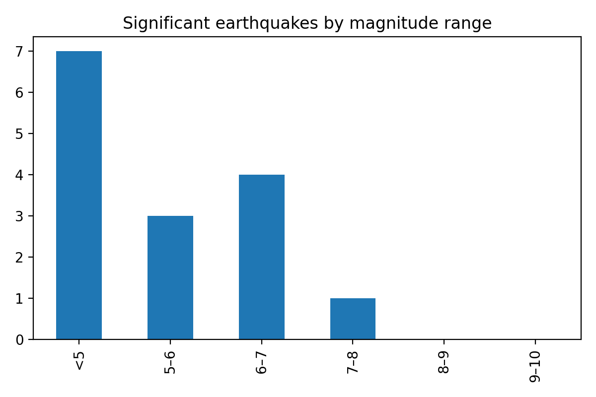

# Significant Earthquakes in the Past Month  
**By Kingsley Osei-Tutu**

## Introduction
Earthquakes are natural events that vary widely in how strong they are and how deeply they occur beneath the Earth’s surface. While magnitude is often the most discussed characteristic, depth plays a major role in how an earthquake is experienced by people on the ground. A deep earthquake with a high magnitude may cause less surface damage than a shallower earthquake of similar strength. Understanding both magnitude and depth together helps provide a more complete picture of seismic activity.

The data used in this article comes from the United States Geological Survey (USGS), which maintains real-time feeds of global earthquake activity. Specifically, this article focuses on the “Significant Earthquakes in the Past Month” dataset. Each row in the dataset represents one earthquake event and includes information such as when it occurred, where it happened, how strong it was, and how deep it was beneath the surface.

The visualizations below are designed for a general audience. The central interactive visualization allows readers to explore individual earthquake events and see how magnitude and depth relate to each other. The additional contextual visualizations provide supporting views that help place these events into broader geographic and numerical context.

## Central Interactive Visualization
The interactive visualization below shows earthquake magnitude on the horizontal axis and depth on the vertical axis. Each point represents a single earthquake event. Hovering over a point reveals details such as the location, magnitude, depth, and time of the earthquake.

<iframe
  src="interactive.html"
  width="100%"
  height="650"
  style="border:0;"
></iframe>

## Contextual Visualization 1: Magnitude Distribution
This visualization groups earthquakes into magnitude ranges and shows how many significant earthquakes occurred in each range during the past month. This helps summarize whether the month was dominated by moderately strong events or included more extreme outliers.

## Contextual Visualization 2: Geographic Distribution
This visualization shows the geographic locations of the significant earthquakes using latitude and longitude. Seeing where earthquakes occur on the globe helps connect the data to real places and highlights patterns along tectonic plate boundaries.

## Data Sources and Citations
The primary dataset used in this article comes from the U.S. Geological Survey Earthquake Hazards Program.

Primary dataset:  
https://earthquake.usgs.gov/earthquakes/feed/v1.0/summary/significant_month.csv

Dataset documentation:  
https://earthquake.usgs.gov/earthquakes/feed/v1.0/csv.php

USGS data is generally in the public domain and may be used without restriction. Credit to the U.S. Geological Survey is requested when possible.  
https://www.usgs.gov/information-policies-and-instructions/copyrights-and-credits  
https://www.usgs.gov/information-policies-and-instructions/acknowledging-or-crediting-usgs

## Analysis Notebooks
The analysis and data exploration used to generate these visualizations were performed in a Jupyter notebook.  
Link to notebook:  
](https://github.com/kingsleyboama/earthquake-article/blob/main/Workbook.ipynb)
